# Vocabulary - [for iPhone](https://youtu.be/Cqtt30G74_8) / [for iPad](https://youtu.be/4a3lslw7OpM)
[我愛背單字 - 針對身為外語苦手的我，量身訂製的APP，有輕快的背景音樂，也有發音，加上可愛的動畫…](https://github.com/William-Weng/Vocabulary)

   

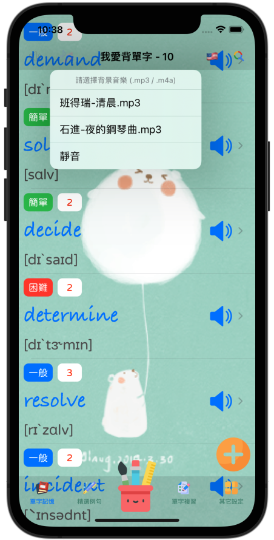 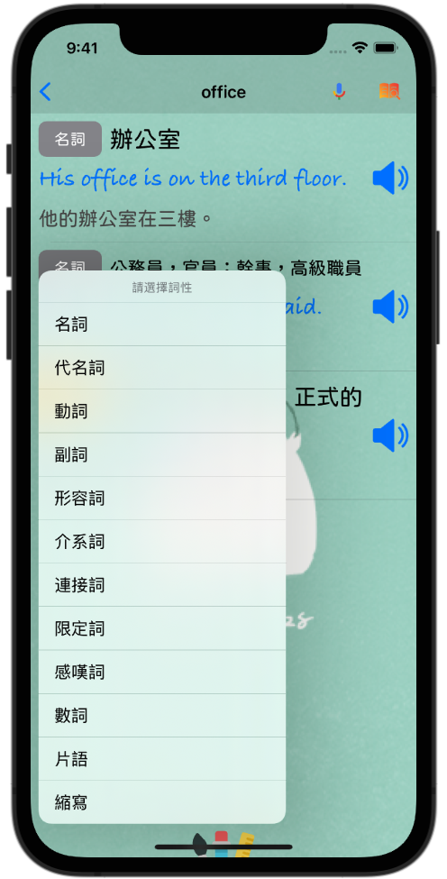 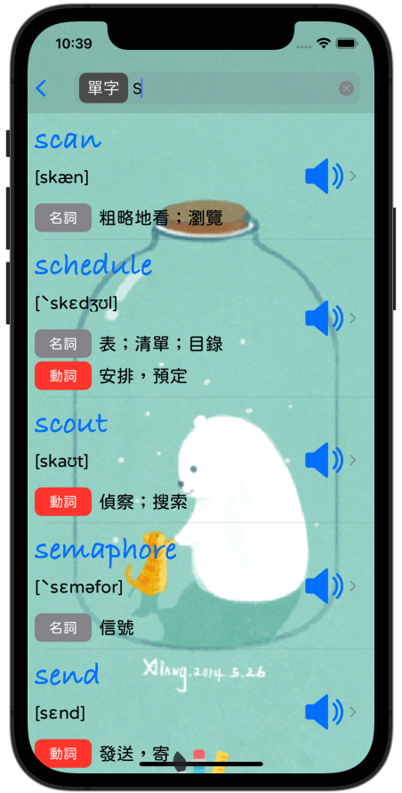
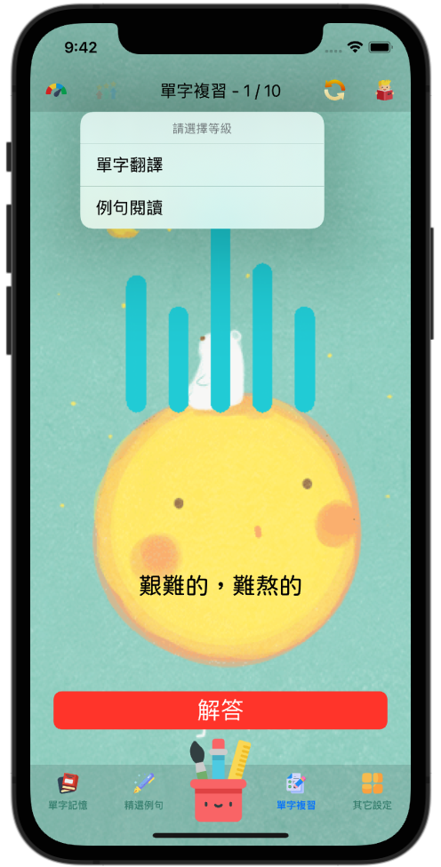 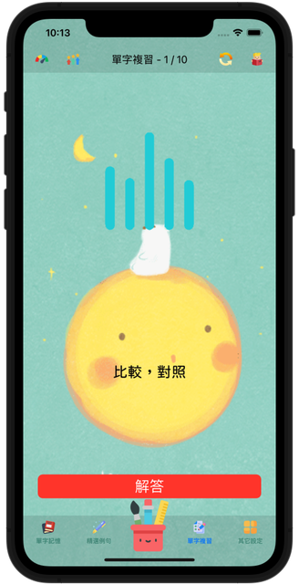 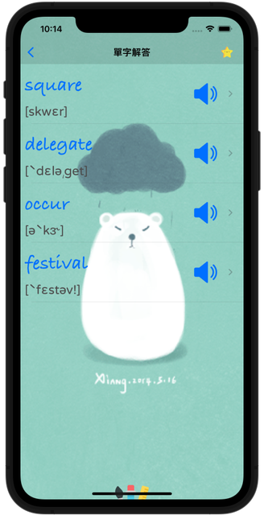
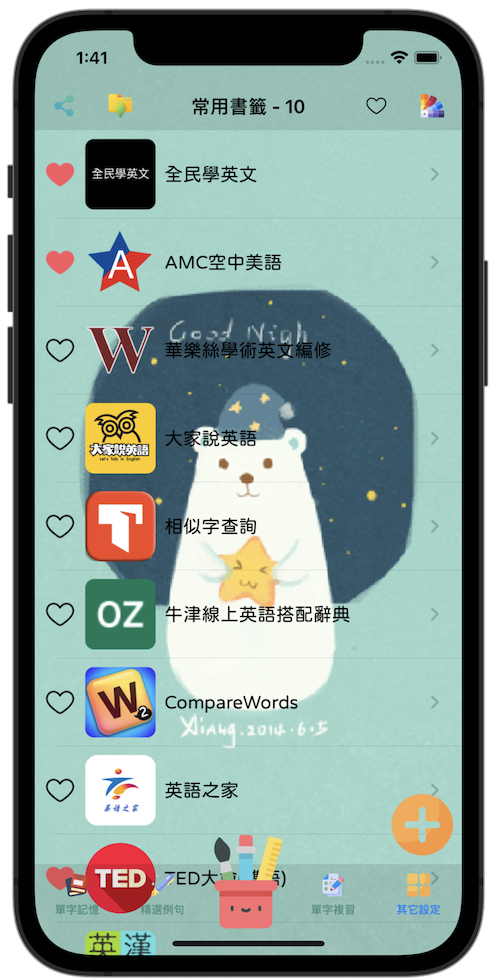 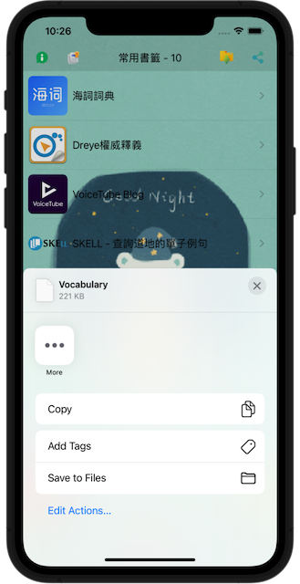 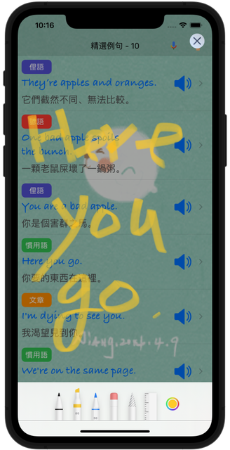
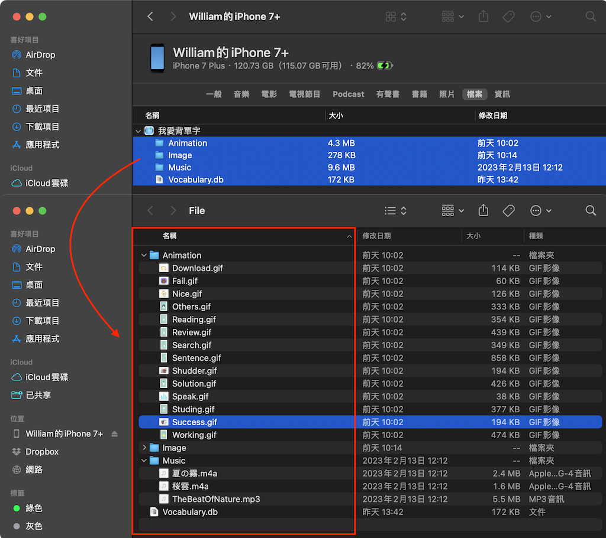
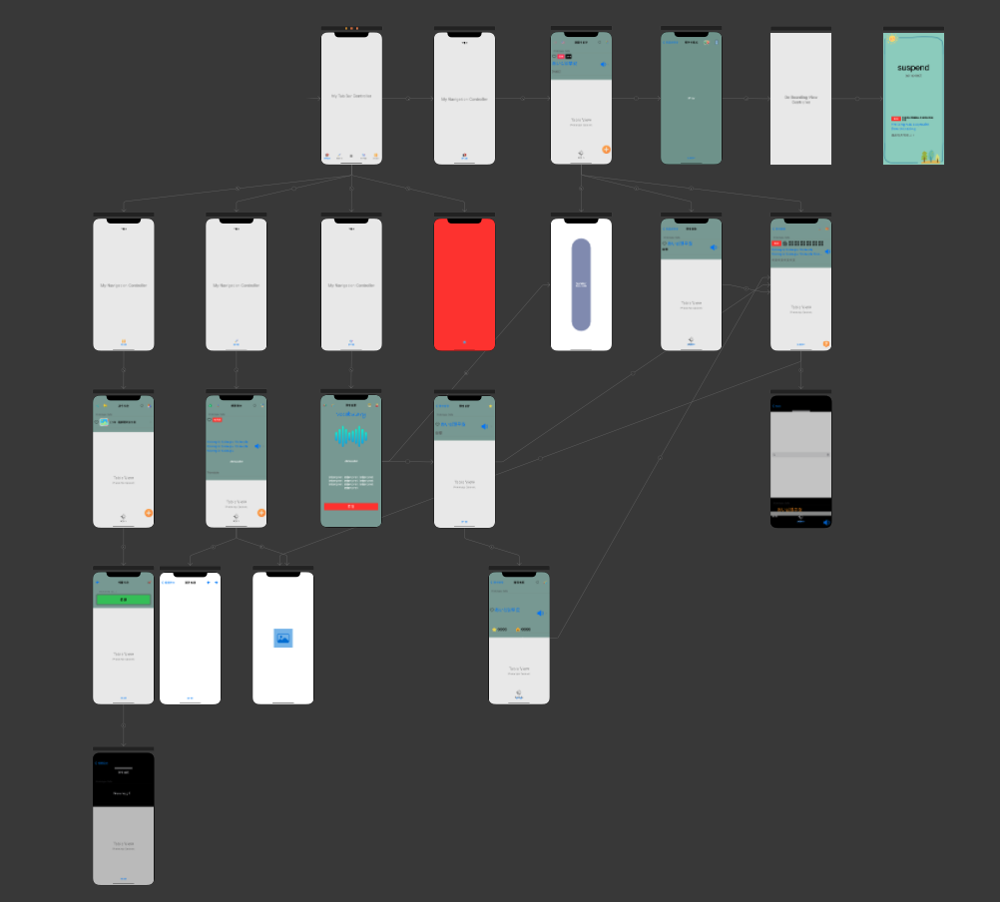

# 附錄：資源下載說明
## 所有資源都是從網路下載，僅作程式分享教學之用，並無侵權之意，資源版權皆屬於原作者所有…

### [引用套件](https://github.com/William-Weng/SwiftPackageManager)
1. [WWPrint](https://github.com/William-Weng/WWPrint)
1. [WWSQLite3Manager](https://github.com/William-Weng/WWSQLite3Manager.git)
1. [WWHUD](https://github.com/William-Weng/WWHUD.git)
1. [WWSlider](https://github.com/William-Weng/WWSlider.git)
1. [WWNetworking](https://github.com/William-Weng/WWNetworking.git)

### [相關圖示](https://www.flaticon.com)
1. AppIcon - [dictionary_2080699.png](https://www.flaticon.com/free-icon/dictionary_2080699)
1. Sound - [volume_727269.png](https://www.flaticon.com/free-icon/volume_727269)
1. Search - [search_3128287.png](https://www.flaticon.com/free-icon/search_3128287)
1. Music - [musical-note_2995101.png](https://www.flaticon.com/free-icon/musical-note_2995101)
1. Volume - [volume_7566455.png](https://www.flaticon.com/free-icon/volume_7566455)
1. NoVolume - [volume_7566449.png](https://www.flaticon.com/free-icon/volume_7566449)
1. Add - [plus_7887095.png](https://www.flaticon.com/free-icon/plus_7887095)
1. Dictionary - [search_9562555.png](https://www.flaticon.com/free-icon/search_9562555)
1. Refresh - [circular-arrow_3227520](https://www.flaticon.com/free-icon/circular-arrow_3227520)
1. Book - [circular-book_2232688](https://www.flaticon.com/free-icon/book_2232688)
1. Test - [exam_3403504](https://www.flaticon.com/free-icon/exam_3403504)
1. Star - [star_1985879](https://www.flaticon.com/free-icon/star_1985879)
1. Cry - [cry_9600663](https://www.flaticon.com/free-icon/cry_9600663)
1. Filter - [choice_4047250](https://www.flaticon.com/free-icon/choice_4047250)
1. Others - [other_7245102](https://www.flaticon.com/free-icon/other_7245102)
1. Picture - [picture_2659360](https://www.flaticon.com/free-icon/picture_2659360)
1. GoBack - [back_786298](https://www.flaticon.com/free-icon/back_786298)
1. GoForward - [back_786298](https://www.flaticon.com/free-icon/back_786298)
1. Level - [level-up_7634463](https://www.flaticon.com/free-icon/level-up_7634463)
1. SpeedMeter - [level-up_7634463](https://www.flaticon.com/free-icon/speedometer_571685)
1. SoundWaves - [waves_875590](https://www.flaticon.com/free-icon/sound-waves_875590)
1. Recorder - [google-voice_3128290](https://www.flaticon.com/free-icon/google-voice_3128290)
1. Information - [information_9485469](https://www.flaticon.com/free-icon/information_9485469)
1. Pencil - [pencil_1142618](https://www.flaticon.com/free-icon/pencil_1142618)
1. Close - [close_9068699](https://www.flaticon.com/free-icon/close_9068699)
1. Clean - [blackboard-eraser_3303661](https://www.flaticon.com/free-icon/blackboard-eraser_3303661)
1. Share - [share_4212381](https://www.flaticon.com/free-icon/share_4212381)
1. Download - [download_3039520](https://www.flaticon.com/free-icon/download_3039520)

### [背景音樂 - .mp3 / .m4a (請在iTunes上自行加入)](http://amachamusic.chagasi.com/)
1. 夏の霧.m4a - [甘茶の音楽工房 - natsunokiri.mp3](http://amachamusic.chagasi.com/music_natsunokiri.html)
1. 桜雲.m4a - [甘茶の音楽工房 - ouun.mp3](http://amachamusic.chagasi.com/music_ouun.html)
1. TheBeatOfNature.mp3 - [Pixabay - the-beat-of-nature-122841.mp3](https://pixabay.com/music/solo-guitar-the-beat-of-nature-122841/)

### [動畫圖示 (請在iTunes上自行加入)](https://imgur.com/)
1. Studing.gif - [桌布-會動的可愛小白熊-1](https://imgur.com/CsxYiU3)
1. Reading.gif - [桌布-會動的可愛小白熊-1](https://imgur.com/bM0UnMb)
1. Search.gif - [桌布-會動的可愛小白熊-1](https://imgur.com/1y04NEk)
1. Working.gif - [桌布-會動的可愛小白熊-2](https://imgur.com/uXEipP5)
1. Solution.gif - [桌布-會動的可愛小白熊-4](https://imgur.com/9KkmcGe)
1. Sentence.gif - [桌布-會動的可愛小白熊-2](https://imgur.com/BzWWaem)
1. Review.gif - [桌布-會動的可愛小白熊-3](https://imgur.com/yh92O1W)
1. Success.gif - [LINE-BROWN & FRIENDS（擬聲樂趣篇♪）](https://www.ilikesticker.com/LineStickerAnimation/S0005943-BROWN-FRIENDS（擬聲樂趣篇♪）/zh-Hant)
1. Fail.gif - [LINE-BROWN & FRIENDS（擬聲樂趣篇♪）](https://www.ilikesticker.com/LineStickerAnimation/S0005943-BROWN-FRIENDS（擬聲樂趣篇♪）/zh-Hant)
1. Nice.gif - [LINE-BROWN & FRIENDS（擬聲樂趣篇♪）](https://www.ilikesticker.com/LineStickerAnimation/S0005943-BROWN-FRIENDS（擬聲樂趣篇♪）/zh-Hant)
1. Speak.gif - [media-amazon.com](https://m.media-amazon.com/images/G/01/digital/music/player/web/EQ_accent.gif)
1. Others.gif - [小白呆萌溫馨動漫gif動圖_動態圖_表情包下載_SOOGIF](http://img.soogif.com/xUsqykJ9IjXSgbL1v4yxlFDlTlhApFVw.gif)
1. Download.gif - [https://in.pinterest.com/meghaumrania/cute-love-gif/](https://i.pinimg.com/originals/d4/89/0e/d4890e94b9e0ff70bf52c392a5e8d752.gif)
1. Talking.gif - [LINE-BROWN & FRIENDS（擬聲樂趣篇♪）](https://www.ilikesticker.com/LineStickerAnimation/S0005943-BROWN-FRIENDS（擬聲樂趣篇♪）/zh-Hant)

### [語言字型](https://medium.com/彼得潘的-swift-ios-app-開發問題解答集/為-ios-app-加入客製字型-custom-font-d2b28b0269e0)
1. KleeOne-SemiBold.ttf - [Google Fonts - KleeOne](https://fonts.google.com/specimen/Klee+One)
1. GamjaFlower-Regular.ttf - [Google Fonts - Gamja Flower](https://fonts.google.com/specimen/Gamja+Flower?query=Gamja+Flower)
1. jf-openhuninn-1.1.ttf - [open 粉圓 - justfont](https://justfont.com/huninn/)
