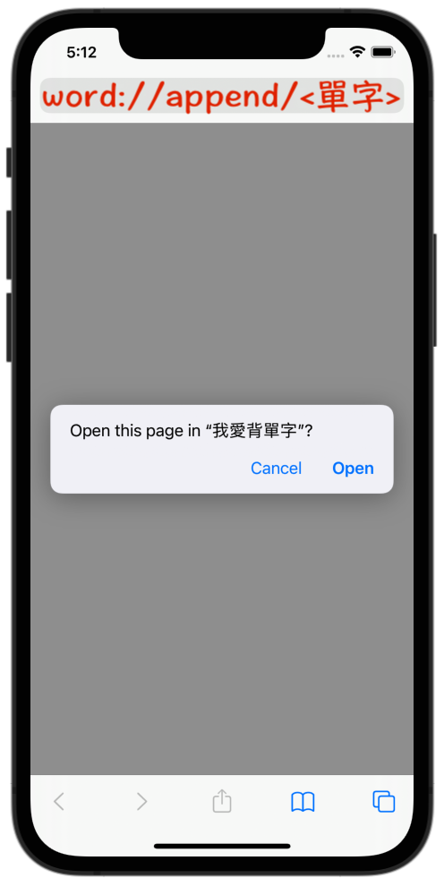
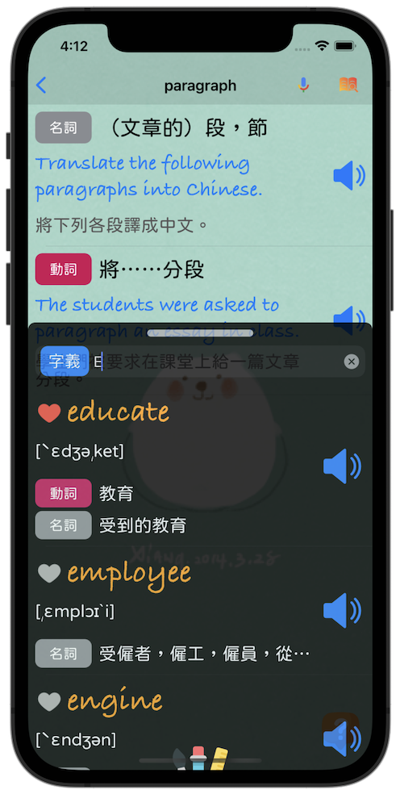
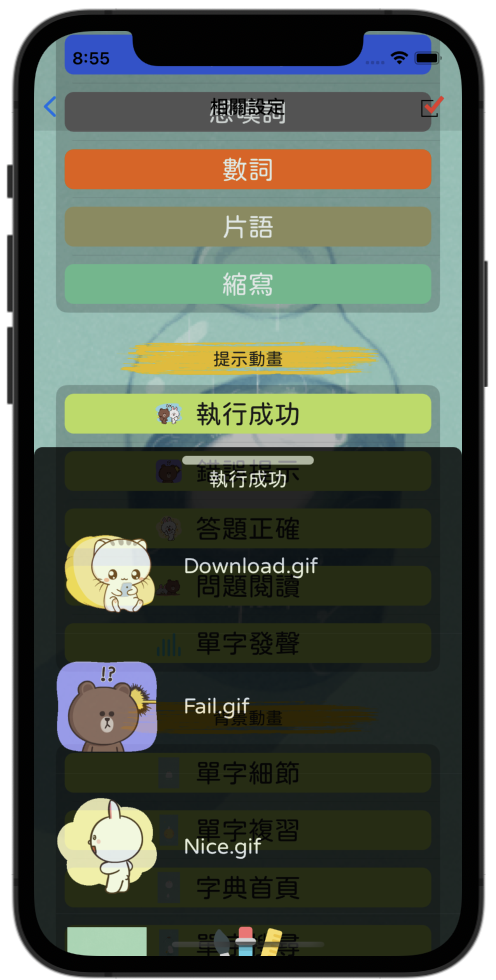

# [Vocabulary - 我愛背單字](https://github.com/William-Weng/Vocabulary)
針對身為外語苦手的我，量身訂製的APP，有輕快的背景音樂，也有發音，加上可愛的動畫，還可以直接使用[Deep Link功能](word://append/vocabulary)…

   

## Deep Link功能
|連結|功能|
|-|-|
|[word://append/<單字>](word://append/<新單字>)|加入新單字|
|[word://search/<單字>](word://search/<新單字>)|搜尋該單字|
|[word://icon/<圖示編號>](word://icon/<圖示編號>)|更新APP圖示|

## 擷圖

  
  
  
  

# 附錄：資源下載說明 (所有資源都是從網路下載，僅作程式分享教學之用，並無侵權之意，資源版權皆屬於原作者所有…)
## [引用套件](https://github.com/William-Weng/SwiftPackageManager)

|套件|功能|
|-|-|
|[WWPrint](https://github.com/William-Weng/WWPrint)|Print小工具|
|[WWSQLite3Manager](https://github.com/William-Weng/WWSQLite3Manager)|SQLite簡易小工具|
|[WWHUD](https://github.com/William-Weng/WWHUD)|Loading動畫小工具|
|[WWSlider](https://github.com/William-Weng/WWSlider)|音量控制條UI|
|[WWNetworking](https://github.com/William-Weng/WWNetworking)|網路下載套件|
|[WWToast](https://github.com/William-Weng/WWToast)|提示訊息小工具|
|[WWNetworking-UIImage](https://github.com/William-Weng/WWNetworking-UIImage)|網路下載圖片小工具|
|[WWAppInstallSource](https://github.com/William-Weng/WWAppInstallSource)|取得APP在哪裡安裝的小工具|
|[WWFloatingView](https://github.com/William-Weng/WWFloatingView)|一個簡單的懸浮拖曳視窗|
|[WWUserDefaults](https://github.com/William-Weng/WWUserDefaults)|加強版的UserDefaults|
|[WWJavaScriptContext](https://github.com/William-Weng/WWJavaScriptContext)|JavaScriptCore小工具|
|[WWOnBoardingViewController](https://github.com/William-Weng/WWOnBoardingViewController)|製作單字卡分頁的小工具|
|[WWTypewriterLabel](https://github.com/William-Weng/WWTypewriterLabel)|打字機效果|
|[WWSimpleChatGPT](https://github.com/William-Weng/WWSimpleChatGPT)|使用ChatGPT功能|
|[WWKeyboardShadowView](https://github.com/William-Weng/WWKeyboardShadowView)|處理鍵盤高度問題|
|[WWHash](https://github.com/William-Weng/WWHash)|取得SHA1值|

## [相關圖示](https://www.flaticon.com)

|套件|功能|
|-|-|
|[AppIcon](https://www.flaticon.com/free-icon/dictionary_2080699)|App圖示|
|[Sound](https://www.flaticon.com/free-icon/volume_727269)|音量調整|
|[Search](https://www.flaticon.com/free-icon/search_3128287)|單字搜尋|
|[Music](https://www.flaticon.com/free-icon/musical-note_2995101)|選擇背景音樂|
|[Shuffle](https://www.flaticon.com/free-icon/shuffle_1082440)|隨機播放背景音樂|
|[Loop](https://www.flaticon.com/free-icon/loop_9053363)|循環播放背景音樂|
|[Volume](https://www.flaticon.com/free-icon/volume_7566455)|設定音量|
|[NoVolume](https://www.flaticon.com/free-icon/volume_7566449)|無音量|
|[Add](https://www.flaticon.com/free-icon/plus_7887095)|新增單字|
|[Dictionary](https://www.flaticon.com/free-icon/search_9562555)|搜尋單字|
|[Refresh](https://www.flaticon.com/free-icon/circular-arrow_3227520)|單字複習題庫更新|
|[Book](https://www.flaticon.com/free-icon/book_2232688)|單字記憶Tab圖示|
|[Test](https://www.flaticon.com/free-icon/exam_3403504)|單字複習Tab圖示|
|[Star](https://www.flaticon.com/free-icon/star_1985879)|單字答對圖示|
|[Cry](https://www.flaticon.com/free-icon/cry_9600663)|單字答錯圖示|
|[Filter](https://www.flaticon.com/free-icon/choice_4047250)|例句屬性選擇|
|[Others](https://www.flaticon.com/free-icon/other_7245102)|其它設定Tab圖示|
|[Picture](https://www.flaticon.com/free-icon/picture_2659360)|書籤預設圖示|
|[GoBack](https://www.flaticon.com/free-icon/back_786298)|網頁上一頁|
|[GoForward](https://www.flaticon.com/free-icon/back_786298)|網頁下一頁|
|[Level](https://www.flaticon.com/free-icon/level-up_7634463)|單字複習等級|
|[SpeedMeter](https://www.flaticon.com/free-icon/speedometer_571685)|單字讀速|
|[SoundWaves](https://www.flaticon.com/free-icon/sound-waves_875590)|單字複習動作鍵|
|[Recorder](https://www.flaticon.com/free-icon/google-voice_3128290)|聲音錄製功能|
|[Information](https://www.flaticon.com/free-icon/information_9485469)|程式原始碼網頁|
|[Pencil](https://www.flaticon.com/free-icon/pencil_1142618)|手寫功能|
|[Close](https://www.flaticon.com/free-icon/close_9068699)|手寫功能關閉|
|[Clean](https://www.flaticon.com/free-icon/blackboard-eraser_3303661)|手寫功能板擦|
|[Share](https://www.flaticon.com/free-icon/share_4212381)|檔案分享功能|
|[Download](https://www.flaticon.com/free-icon/download_3039520)|檔案下載功能|
|[NextArrow](https://www.flaticon.com/free-icon/next_709586)|Cell的下一頁指示|
|[Notice_On](https://www.flaticon.com/free-icon/heart_2589175)|我的最愛開啟|
|[Notice_Off](https://www.flaticon.com/free-icon/heart_2589197)|我的最愛關閉|
|[Question](https://www.flaticon.com/free-icon/request_7887104)|快速單字搜尋功能|
|[HardWork_On](https://www.flaticon.com/free-icon/goal_1600071)|單字翻譯難度 (已讀)|
|[HardWork_Off](https://www.flaticon.com/free-icon/goal_1599969)|單字翻譯難度 (未讀)|
|[Palette](https://www.flaticon.com/free-icon/color-palette_3214398)|調色盤|
|[Mark](https://www.flaticon.com/free-icon/mark_10099668)|調色盤設定|
|[CrayonPainting](https://www.ac-illust.com/main/detail.php?id=1266133)|調色盤Header背景色|
|[WordCard](https://www.flaticon.com/free-icon/card-games_2118315)|單字卡|
|[SunTreeBorder](https://zh.lovepik.com/image-401216042/sun-tree-border.html)|單字卡背景|
|[Vertical](https://www.flaticon.com/free-icon/smartphones_604609)|畫面旋轉功能|
|[Talking](https://www.flaticon.com/free-icon/talking_3002662)|對談|
|[Token](https://www.flaticon.com/free-icon/key_3039392)|ChatGPT的Token|

## [背景音樂 - .mp3 / .m4a (請在iTunes上自行加入)](http://amachamusic.chagasi.com/)

|音樂|出處|
|-|-|
|[夏の霧.m4a](http://amachamusic.chagasi.com/music_natsunokiri.html)|[甘茶の音楽工房](http://amachamusic.chagasi.com)|
|[桜雲.m4a](http://amachamusic.chagasi.com/music_ouun.html)|[甘茶の音楽工房](http://amachamusic.chagasi.com)|
|[TheBeatOfNature.mp3](https://pixabay.com/music/solo-guitar-the-beat-of-nature-122841/)|[Olexy - Pixabay](https://pixabay.com/users/olexy-25300778/)|
|[一小時睡眠舒壓音樂詩歌.mp3](https://youtu.be/WYW-GO7uXuM)|[來婉音樂](https://www.youtube.com/hashtag/來婉音樂)|

## [動畫圖示 (請在iTunes上自行加入)](https://imgur.com/)

|動畫|出處|功能|
|-|-|-|
|[Studing.gif](https://imgur.com/CsxYiU3)|[Imgur](https://imgur.com/)|動畫背景|
|[Reading.gif](https://imgur.com/bM0UnMb)|[Imgur](https://imgur.com/)|動畫背景|
|[Search.gif](https://imgur.com/1y04NEk)|[Imgur](https://imgur.com/)|動畫背景|
|[Working.gif](https://imgur.com/uXEipP5)|[Imgur](https://imgur.com/)|動畫背景|
|[Solution.gif](https://imgur.com/9KkmcGe)|[Imgur](https://imgur.com/)|動畫背景|
|[Sentence.gif](https://imgur.com/BzWWaem)|[Imgur](https://imgur.com/)|動畫背景|
|[Review.gif](https://imgur.com/yh92O1W)|[Imgur](https://imgur.com/)|動畫背景|
|[Palette.gif](https://imgur.com/9KkmcGe)|[Imgur](https://imgur.com/)|動畫背景|
|[Solution.gif](http://mt.sohu.com/20160309/n439891021.shtml)|[搜狐](http://mt.sohu.com/l)|動畫背景|
|[Success.gif](https://www.ilikesticker.com/LineStickerAnimation/S0005943-BROWN-FRIENDS（擬聲樂趣篇♪）/zh-Hant)|[LINE Stickers & Themes](https://www.ilikesticker.com)|HUD圖示|
|[Fail.gif](https://www.ilikesticker.com/LineStickerAnimation/S0005943-BROWN-FRIENDS（擬聲樂趣篇♪）/zh-Hant)|[LINE Stickers & Themes](https://www.ilikesticker.com)|HUD圖示|
|[Nice.gif](https://www.ilikesticker.com/LineStickerAnimation/S0005943-BROWN-FRIENDS（擬聲樂趣篇♪）/zh-Hant)|[LINE Stickers & Themes](https://www.ilikesticker.com)|HUD圖示|
|[Talking.gif](https://www.ilikesticker.com/LineStickerAnimation/S0005943-BROWN-FRIENDS（擬聲樂趣篇♪）/zh-Hant)|[LINE Stickers & Themes](https://www.ilikesticker.com)|HUD圖示|
|[Speak.gif](https://m.media-amazon.com/images/G/01/digital/music/player/web/EQ_accent.gif)|[media-amazon](https://m.media-amazon.com)|單字複習功能|
|[Others.gif](http://img.soogif.com/xUsqykJ9IjXSgbL1v4yxlFDlTlhApFVw.gif)|[img.soogif.com](http://img.soogif.com)|動畫背景|
|[Download.gif](https://i.pinimg.com/originals/d4/89/0e/d4890e94b9e0ff70bf52c392a5e8d752.gif)|[in.pinterest.com](https://in.pinterest.com/meghaumrania/cute-love-gif/)|下載圖片|

## [語言字型](https://medium.com/彼得潘的-swift-ios-app-開發問題解答集/為-ios-app-加入客製字型-custom-font-d2b28b0269e0)

|字型|出處|功能|
|-|-|-|
|[KleeOne-SemiBold.ttf](https://fonts.google.com/specimen/Klee+One)|[Google-Font](https://fonts.google.com)|日文字型|
|[GamjaFlower-Regular.ttf](https://fonts.google.com/specimen/Gamja+Flower?query=Gamja+Flower)|[Google-Font](https://fonts.google.com)|韓文字型|
|[jf-openhuninn-2.0.ttf](https://justfont.com/huninn/)|[open 粉圓 - justfont](https://justfont.com/)|中文字型|
