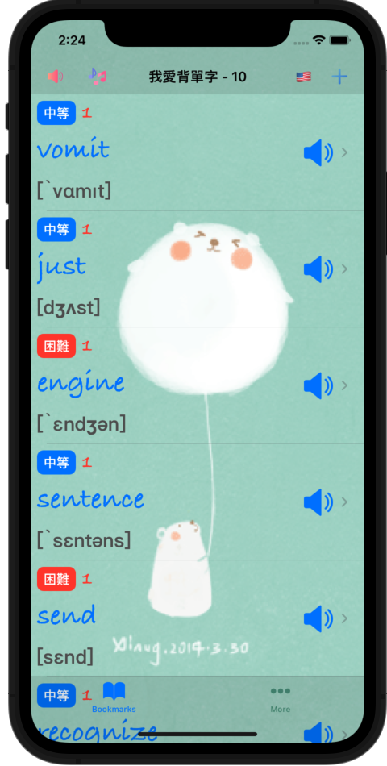

# Vocabulary
我愛背單字 - 針對身為外語苦手的我，量身訂製的APP

  

# 附錄：資源下載說明
## 所有資源都是從網路下載，僅作程式分享教學之用，並無侵權之意，資源版權皆屬於原圖作者所有…

### [相關圖示](https://www.flaticon.com)
1. AppIcon - [dictionary_4033323.png](https://www.flaticon.com/free-icon/knowledge_2997319)
1. Sound - [volume_727269.png](https://www.flaticon.com/free-icon/volume_727269)
1. Search - [search_3128287.png](https://www.flaticon.com/free-icon/search_3128287)
1. Music - [musical-note_2995101.png](https://www.flaticon.com/free-icon/musical-note_2995101)
1. Volume - [volume_7566455.png](https://www.flaticon.com/free-icon/volume_7566455)
1. NoVolume - [volume_7566449.png](https://www.flaticon.com/free-icon/volume_7566449)
1. Add - [plus_9380151.png](https://www.flaticon.com/free-icon/plus_9380151)

### [背景音樂](http://amachamusic.chagasi.com/)
1. 夏の霧.mp3 - [甘茶の音楽工房 - natsunokiri.mp3](http://amachamusic.chagasi.com/music_natsunokiri.html)
1. TheBeatOfNature.mp3 - [Pixabay - the-beat-of-nature-122841.mp3](https://pixabay.com/music/solo-guitar-the-beat-of-nature-122841/)

### [動畫圖示](https://imgur.com/)
1. Studing.gif - [桌布-會動的可愛小白熊-1](https://imgur.com/CsxYiU3)
1. Working.gif - [桌布-會動的可愛小白熊-1](https://imgur.com/6VsD3md)
1. Reading.gif - [桌布-會動的可愛小白熊-1](https://imgur.com/bM0UnMb)
1. Success.gif - [LINE-BROWN & FRIENDS（擬聲樂趣篇♪）](https://www.ilikesticker.com/LineStickerAnimation/S0005943-BROWN-FRIENDS（擬聲樂趣篇♪）/zh-Hant)
1. Fail.gif - [LINE-BROWN & FRIENDS（擬聲樂趣篇♪）](https://www.ilikesticker.com/LineStickerAnimation/S0005943-BROWN-FRIENDS（擬聲樂趣篇♪）/zh-Hant)
1. Nice.gif - [LINE-BROWN & FRIENDS（擬聲樂趣篇♪）](https://www.ilikesticker.com/LineStickerAnimation/S0005943-BROWN-FRIENDS（擬聲樂趣篇♪）/zh-Hant)
